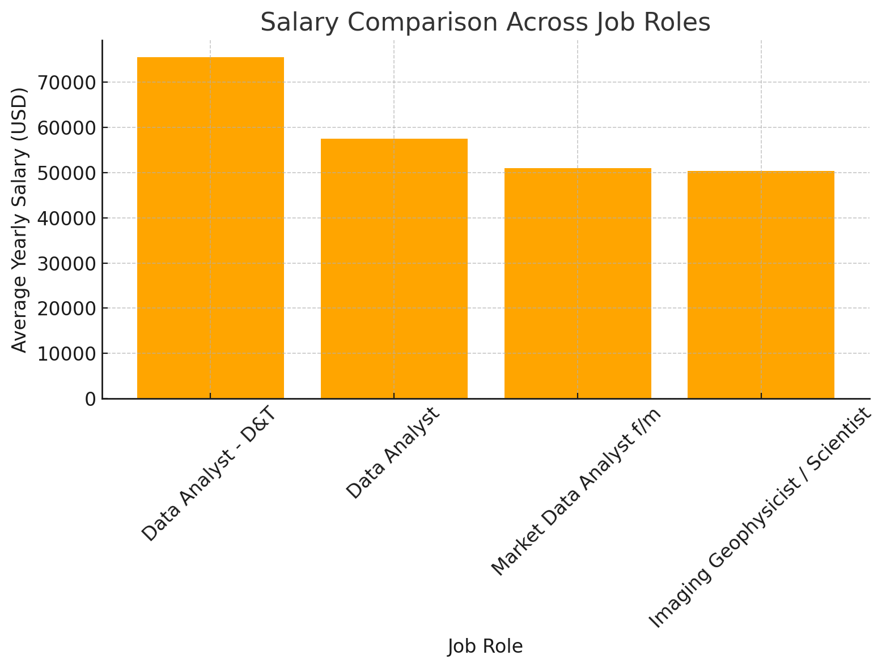
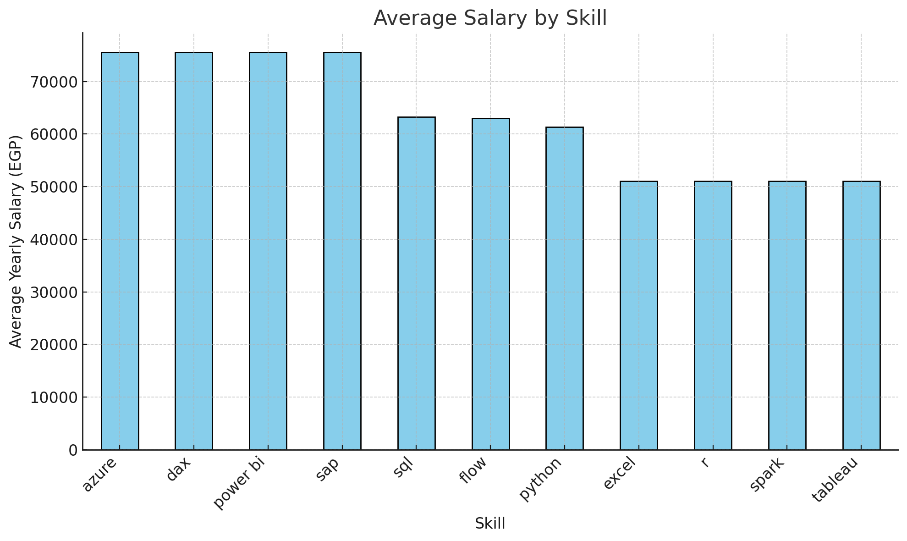
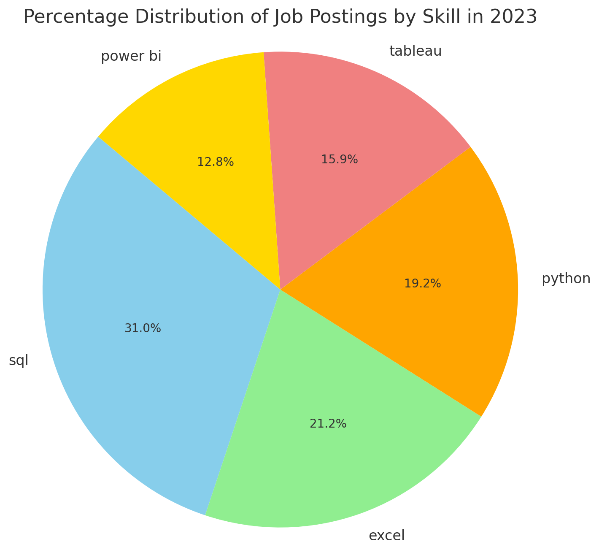
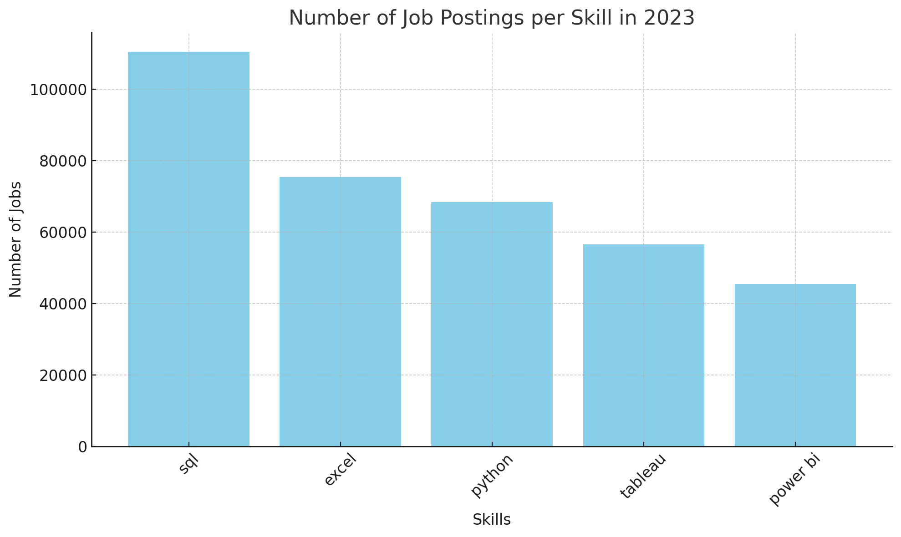
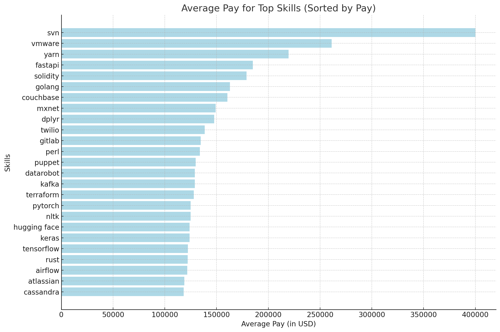
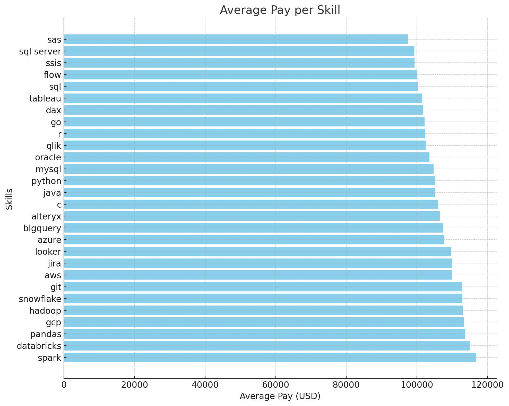
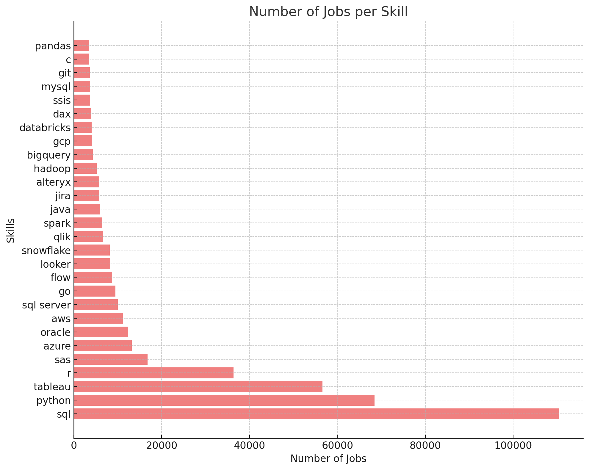

# Introduction
📊 Explore the 2023 data job market! This project focuses on data roles, analyzing trends in 💰 top-paying positions, 🔥 must-have skills, and 📈 how demand meets salary in the world of data jobs. Dive into the insights to understand the evolving landscape of data careers.

🔍 SQL queries? Check them out here: [Project_SQL folder](Project_SQL)
# Background
### The questions I wanted to answer through my SQL queries were:
1. What are the top-paying data analyst jobs?
2. What skills are required for these top-paying jobs?
3. What skills are most in demand for data analysts?
4. Which skills are associated with higher salaries?
5. What are the most optimal skills to learn?
# Tools I Used
For my deep dive into the data analyst job market, 
I harnessed the power of several key tools:
- **SQL:** The backbone of my analysis, allowing me to query the database and unearth critical insights.
- **PostgreSQL:** The chosen database management system, ideal for handling the job posting data.
- **Visual Studio Code:** My go-to for database management and executing SQL queries.
- **Git & GitHub:** Essential for version control and sharing my SQL scripts and analysis, ensuring collaboration and project tracking.
# The Analysis
Each query for this project aimed at investigating specific aspects of the data analyst job market. Here’s how I approached each question:

### 1. Top Paying Data Analyst Jobs
To identify the highest-paying roles, I filtered data analyst positions by average yearly salary and location, focusing on jobs in Egypt. This query highlights the high paying opportunities in the field.

```sql
SELECT job_id,
    job_title,
    name AS company_name,
    job_location,
    job_schedule_type,
    salary_year_avg AS avg_yearly_salary,
    job_posted_date::DATE
FROM job_postings_fact
    LEFT JOIN company_dim ON job_postings_fact.company_id = company_dim.company_id
WHERE job_title_short LIKE '%Data%Analyst%'
    AND salary_year_avg IS NOT NULL
    AND job_location LIKE '%Egypt%'
ORDER BY avg_yearly_salary DESC;
```
Here's the breakdown of the top data analyst jobs in Egypt in 2023:
- **Companies Involved:** <br>
HEINEKEN offers a role as "Data Analyst - D&T". <br>
Contentsquare offers a "Data Analyst" role.<br>
Bosch Group offers a position as "Market Data Analyst f/m".<br>
CGG offers an "Imaging Geophysicist / Scientist" role specifically targeting 2023 graduates.
- **Job Locations:** <br>
All the roles are located in Egypt. However, two specifically mention Cairo, suggesting a higher demand for data-related jobs in the capital.
- **Salary Analysis:**
The highest average yearly salary is offered by HEINEKEN at $75,550.<br>
The lowest average yearly salary is offered by CGG at $50,400.<br>
Other salaries include $57,500 for the role at Contentsquare and $51,014 for the position at Bosch Group.<br>
The average yearly salary across all roles is approximately $58,116.
- **Job Schedule:** <br>
All positions are full-time, indicating a stable demand for full-time Data Analysts in Egypt across different sectors.<br>


*Bar Graph visualizing the salary comparison across job roles*
<br>
### 2. Skills For Top Paying Jobs
To understand what skills are required for the top-paying jobs, I joined the job postings with the skills data, providing insights into what employers value for high-compensation roles.
```sql
SELECT top_jobs_skills.job_id,
    top_jobs_skills.job_title,
    top_jobs_skills.company_name,
    top_jobs_skills.job_location,
    top_jobs_skills.job_schedule_type,
    top_jobs_skills.avg_yearly_salary,
    top_jobs_skills.job_posted_date::DATE,
    skills.skills
FROM (
        SELECT job_postings_fact.job_id,
            job_title,
            company_dim.name AS company_name,
            job_location,
            job_schedule_type,
            salary_year_avg AS avg_yearly_salary,
            job_posted_date
        FROM job_postings_fact
            LEFT JOIN company_dim ON job_postings_fact.company_id = company_dim.company_id
        WHERE job_title_short LIKE '%Data%Analyst%'
            AND salary_year_avg IS NOT NULL
            AND job_location LIKE '%Egypt%'
        ORDER BY avg_yearly_salary DESC
    ) AS top_jobs_skills
    LEFT JOIN skills_job_dim AS job_skills ON top_jobs_skills.job_id = job_skills.job_id
    INNER JOIN skills_dim AS skills ON job_skills.skill_id = skills.skill_id;
```
Here's the breakdown of the most demanded skills for the top 10 highest paying data analyst jobs in 2023:

**Top Skills Summary:<br>**
| Skill     | Count |
|-----------|-------|
| Python    | 3     |
| SQL       | 2     |
| Flow      | 2     |
| Azure     | 1     |
| Power BI  | 1     |
| DAX       | 1     |
| SAP       | 1     |
| R         | 1     |
| Spark     | 1     |
| Excel     | 1     |
 
 - Python is the most in-demand skill, followed by SQL and Flow.
 - Other skills like Azure, Power BI, DAX, SAP, R, Spark, and Excel appear less frequently, indicating more specialized requirements for certain roles.<br>

 
 *Bar graph visualizing the Average Salary by Skill*
 <br>
 ### 3. In-Demand Skills for Data Analysts
 This query helped identify the skills most frequently requested in job postings, directing focus to areas with high demand.
 ```sql
SELECT skills,
    number_of_jobs
FROM (
        SELECT skill_id,
            COUNT(job_postings_fact.job_id) AS number_of_jobs
        FROM job_postings_fact
            LEFT JOIN skills_job_dim ON job_postings_fact.job_id = skills_job_dim.job_id
        WHERE job_title_short LIKE '%Data%Analyst'
        GROUP BY skills_job_dim.skill_id
    ) AS skill_job_id
    INNER JOIN skills_dim ON skill_job_id.skill_id = skills_dim.skill_id
ORDER BY number_of_jobs DESC
LIMIT 5;
 ```
 The following percentages represent each skill's share of the total job postings:
 - SQL: 30.9%
 - Excel: 21.1%
 - Python: 19.2%
 - Tableau: 15.9%
 - Power BI: 12.7%
 <br>
 
 
*Pie chart visualizing the Percentage Distribution of Job Postings by Skill in 2023*
 <br>
<br>
<br>
**Here's the breakdown of the most demanded skills for data analysts in 2023:** <br>

 
  *Bar chart visualizing the Number of Job Postings Per Skill in 2023*
<br>
### 4. Skills Based on Salary
Exploring the average salaries associated with different skills revealed which skills are the highest paying.
```sql
SELECT skills,
    ROUND(AVG(salary_year_avg), 0) AS avg_pay
FROM job_postings_fact
    INNER JOIN skills_job_dim ON job_postings_fact.job_id = skills_job_dim.job_id
    INNER JOIN skills_dim ON skills_job_dim.skill_id = skills_dim.skill_id
WHERE job_title_short LIKE '%Data%Analyst%'
    AND salary_year_avg IS NOT NULL
GROUP BY skills
ORDER BY avg_pay DESC
LIMIT 25;
```
INSIGHTS FROM PAY-PER-SKILL ANALYSIS:
 
 1. SVN commands the highest average salary at $400,000, showing its importance in software version control.
 2. Virtualization skills like VMware have a high demand, with an average pay of $261,250.
 3. Web development and blockchain-related skills such as Yarn, FastAPI, and Solidity are highly valued, with average salaries ranging from $179,000 to $219,575.
 4. Machine learning frameworks (e.g., PyTorch, TensorFlow) and AI tools (e.g., Hugging Face) offer competitive average salaries, around $123,000 to $125,000.
 5. Overall, specialized technical skills in areas like version control, web frameworks, blockchain, virtualization, and machine learning are in high demand with significant pay scales.

 
 *Bar Chart visualizing the Average Pay for Top Skills (Sorted by Pay)*
 <br>
### 5. Most Optimal Skills to Learn
Combining insights from demand and salary data, this query aimed to pinpoint skills that are both in high demand and have high salaries, offering a strategic focus for skill development.
```sql
WITH top_paying_skills AS (
    SELECT skills_dim.skill_id,
        skills_dim.skills,
        ROUND(AVG(salary_year_avg), 0) AS avg_pay
    FROM job_postings_fact
        INNER JOIN skills_job_dim ON job_postings_fact.job_id = skills_job_dim.job_id
        INNER JOIN skills_dim ON skills_job_dim.skill_id = skills_dim.skill_id
    WHERE job_title_short LIKE '%Data%Analyst%'
        AND salary_year_avg IS NOT NULL
    GROUP BY skills_dim.skill_id
),
most_demand AS (
    SELECT skills_dim.skill_id,
        skills_dim.skills,
        number_of_jobs
    FROM (
            SELECT skills_job_dim.skill_id,
                COUNT(job_postings_fact.job_id) AS number_of_jobs
            FROM job_postings_fact
                LEFT JOIN skills_job_dim ON job_postings_fact.job_id = skills_job_dim.job_id
            WHERE job_title_short LIKE '%Data%Analyst'
            GROUP BY skills_job_dim.skill_id
        ) AS skill_job_id
        INNER JOIN skills_dim ON skill_job_id.skill_id = skills_dim.skill_id
)
SELECT top_paying_skills.skills,
    avg_pay,
    number_of_jobs
FROM top_paying_skills
    INNER JOIN most_demand ON top_paying_skills.skill_id = most_demand.skill_id
WHERE avg_pay > 97348
    AND -- 97348 is the average pay across Data Analysts jobs.
    number_of_jobs > 3118 -- The average number of jobs per skill.
```
INSIGHTS:
     
     1. Top Skills:
     - **SQL** has the highest demand with 110,380 job postings and an average pay of $100,299, making it a key skill in the job market.
     - **AWS** and **Azure** are highly demanded cloud skills with job postings around 11,197 and 13,221, respectively, and average pays of over $107,000.
     - **Python** remains a critical programming language with 68,409 job postings and a solid average pay of $105,115.
     
     2. Data-related Tools: Skills such as **Tableau** (56,569 job postings), **Spark**, and **Databricks** also feature prominently, reflecting the increasing demand for data analytics and engineering.
     
     3. High-Paying Skills: **Snowflake** ($112,876), **GCP** ($113,367), and **Databricks** ($114,910) offer among the highest average salaries, indicating the growing importance of cloud and data processing platforms.
**Here's a breakdown:**


*Bar chart visualizing the Average Pay per Skill*
<br>
<br>

*Bar chart visualizing the Number of Jobs per Skill*

# What I Learned
During this project, I built up my SQL skills in key areas:

🔗 Advanced Queries
Mastered joining multiple tables and using WITH clauses for temporary data setups.

📊 Data Summarization
Used GROUP BY along with COUNT() and AVG() to analyze and summarize information.

🧩 Problem Solving
Turned real-world questions into effective SQL queries to find meaningful insights.
# Conclusions
### Insights
1. **Top-Paying Data Analyst Roles Identified**<br>
- Insight: Successfully pinpointed the highest-paying data analyst positions in Egypt for 2023, highlighting leading companies like HEINEKEN and Contentsquare, and emphasizing Cairo as a key job hub.
2. **Essential Skills for High Compensation Highlighted**<br>
- Insight: Determined that Python, SQL, and Flow are the most sought-after skills for top-paying data analyst jobs, indicating their critical role in securing lucrative positions.
3. **Skill Demand and Salary Correlation Analyzed**<br>
- Insight: Revealed a strong relationship between specific skills and higher salaries, with advanced technical proficiencies in areas like cloud computing (AWS, Azure) and data processing platforms (Snowflake, Databricks) commanding premium pay.
4. **In-Demand Skills Trends Mapped**<br>
- Insight: Identified the most frequently requested skills in data analyst job postings, such as SQL (30.9%), Excel (21.1%), and Python (19.2%), providing a clear direction for skill acquisition based on market demand.
5. **Strategic Skill Development Recommendations Provided**<br>
- Insight: Offered actionable guidance on which skills to prioritize for career advancement, focusing on those that are both highly demanded and offer substantial salary benefits, such as SQL, AWS, and Python.

### Closing Thoughts
This project provided a comprehensive look into the 2023 data analyst job market, uncovering key trends and essential skills that drive both demand and salaries. By utilizing advanced SQL techniques, I gained valuable insights into which roles and competencies are most valued by employers. These findings not only highlight the current landscape but also offer a clear direction for future career growth and skill development. Moving forward, the knowledge acquired from this analysis will serve as a solid foundation for navigating and succeeding in the ever-evolving field of data analytics.


[def]: assets\1_top_paying_jobs.png